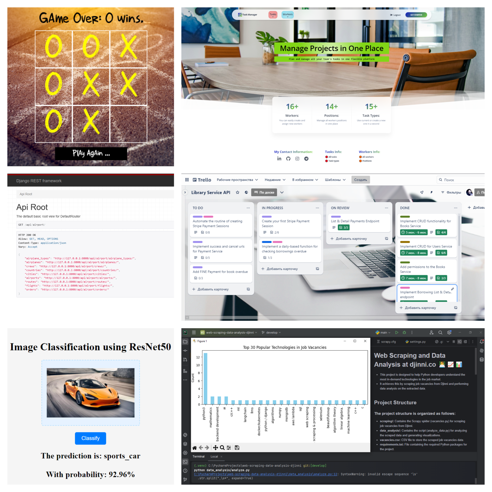
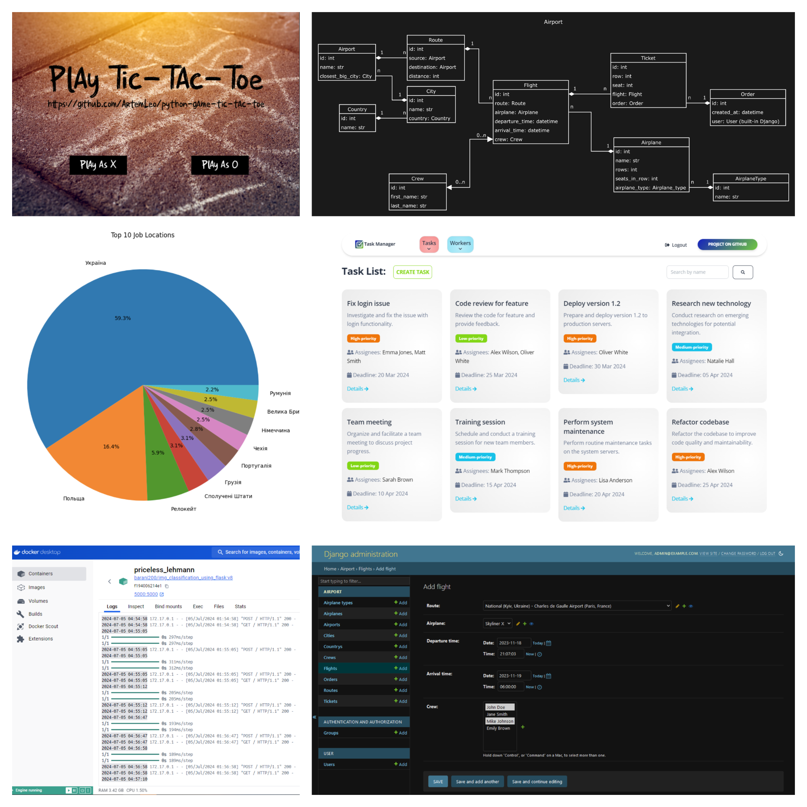

<h1 align="center">Hi 👋, I'm Artem Andriushchenko</h1>

---

▪️ I am a goal-oriented software engineer specializing in Python. I have experience working in both a small startup
environment and a mid-sized company with up to 100 employees. 
▪️ During this time, I have completed several projects that highlight my expertise in Python, object-oriented
programming (OOP), Flask, FastAPI, Django REST, business analysis, dashboard development, and the use of relational
databases. 
▪️ My GitHub also showcases projects in data analytics and machine learning. Over the past two years, I have developed
the ability to adapt to challenges and significantly enhanced my time management skills. 

---

 

---

<h3 align="left">Languages and Tools:</h3>

<table align="center">
  <tr>
     <td align="center"  width="88">
         
       Python
    </td>
    <td align="center" width="88">
        
       Git
    </td>
    <td align="center" width="88">
          
       Slack
    </td>
    <td align="center" width="88">
        
       Django
    </td>
    <td align="center" width="88">
        
       MySQL
    </td>
    <td align="center" width="88">
       
        K8s
    </td>
    <td align="center" width="88">
         
       VSCode
    </td>
    <td align="center" width="88">
      
       MongoDB
    </td>
    <td align="center" width="88">
      
       Flask
    </td> 
    <td align="center" width="88">
       
        FastAPI
    </td>  
    </tr>
    <td align="center" width="88">
        
       PyCharm
    </td>
    <td align="center" width="88"> 
        
       Linux
    </td>
    <td align="center"  width="88">
        
       Windows
    </td>
    <td align="center" width="88">
        
       PostgreSQL
    </td>
      <td align="center" width="88">
        
       Docker
    </td>
    <td align="center" width="88">
      
       RabbitMQ
    </td>
    <td align="center" width="88">
         </a>
       Pytest
    </td>
    <td align="center" width="88">
        
       Pandas
     </td>
    <td align="center" width="88">
        
       Postman
    </td>
    <td align="center" width="88">
        
         Celery 
    </td>  
  </table>

---
